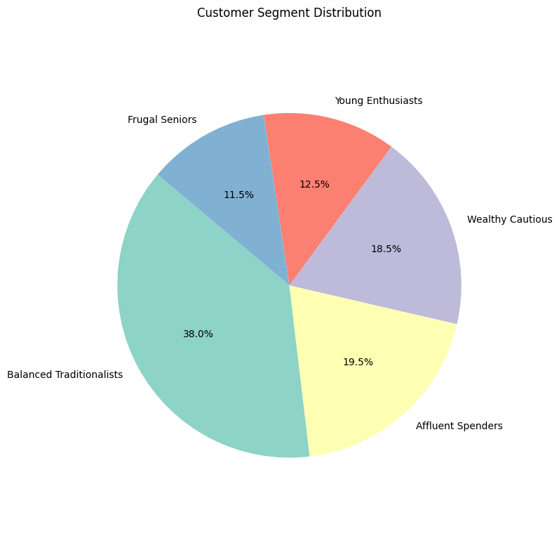

# 🛍️ Mall Customer Segmentation System  
### Unsupervised Learning for Business Strategy (K-Means Clustering)

---

## 🚀 Project Overview

Dalam industri retail modern, pendekatan “one-size-fits-all” sudah tidak relevan. Bisnis membutuhkan pemahaman mendalam terhadap perilaku pelanggan untuk menciptakan strategi pemasaran yang efektif dan efisien.

Project ini membangun sistem **customer segmentation berbasis machine learning (unsupervised learning)** untuk mengelompokkan pelanggan mall berdasarkan karakteristik dan perilaku mereka.

> 💡 Fokus utama: **mengubah data → insight → strategi bisnis**

---

## 🎯 Business Problem

- Pelanggan diperlakukan secara generik
- Tidak ada segmentasi berbasis data
- Campaign marketing kurang efektif
- Alokasi budget tidak optimal

---

## 💡 Solution Approach

Pipeline yang dibangun dalam project ini:
Data → EDA → Feature Selection → Clustering (K-Means) → Evaluation → Business Interpretation

---

## 📊 Dataset Overview

Dataset terdiri dari **200 pelanggan** dengan fitur:

- **Gender**
- **Age**
- **Annual Income (k$)**
- **Spending Score (1–100)**

---

## 🔍 Exploratory Data Analysis (EDA)

Beberapa insight penting dari analisis:

- Dominasi pelanggan usia **20–40 tahun**
- Distribusi gender relatif seimbang
- Tidak terdapat hubungan linear antara income dan spending
- Terlihat potensi cluster yang jelas dari scatter plot

---

## 🤖 Machine Learning Approach

### 📌 Algorithm:
- **K-Means Clustering**

### 📌 Optimal Cluster:
- Ditentukan menggunakan **Elbow Method**
- Hasil optimal: **k = 5**

---

## 📊 Clustering Analysis

Segmentasi dilakukan dengan beberapa pendekatan:

### 1. Age vs Spending Score  
### 2. Income vs Spending Score  
### 3. 3D Clustering (Income, Age, Spending Score)

Visualisasi mencakup:
- Scatter plot cluster
- Decision boundary
- 3D clustering visualization (Plotly)

---

## 🧠 Customer Segmentation (Final Insight)

Hasil clustering menghasilkan **5 segmen pelanggan utama**:

### 🟤 Frugal Seniors
- Usia tinggi, income rendah, spending rendah  
- 🔻 Low priority segment  

---

### 🟢 Affluent Spenders
- Income tinggi, spending tinggi  
- 💎 High-value customers (target utama)  

---

### 🔵 Wealthy Cautious
- Income tinggi, spending rendah  
- 🎯 Perlu strategi aktivasi  

---

### 🟡 Young Enthusiasts
- Usia muda, spending tinggi  
- 📢 Cocok untuk promo agresif  

---

### ⚪ Balanced Traditionalists
- Income & spending moderat  
- 🔁 Segment stabil & loyal  

---

## 📈 Segment Distribution

---

## 📈 Business Impact
- 🎯 Menargetkan promosi lebih tepat
- 💰 Meningkatkan conversion rate
- 📊 Optimasi marketing budget
- 🔁 Meningkatkan customer retention

---

## 🔮 Strategic Recommendations
- Fokus pada Affluent Spenders untuk loyalty program
- Aktivasi Wealthy Cautious melalui personalized campaign
- Maksimalkan engagement Young Enthusiasts dengan promo digital
- Maintain Balanced Traditionalists untuk stabilitas revenue

## 🚀 Future Improvements
- Dashboard interaktif (Streamlit / Power BI)
- Real-time customer segmentation
- Integration dengan CRM system
- Recommendation system berbasis segment